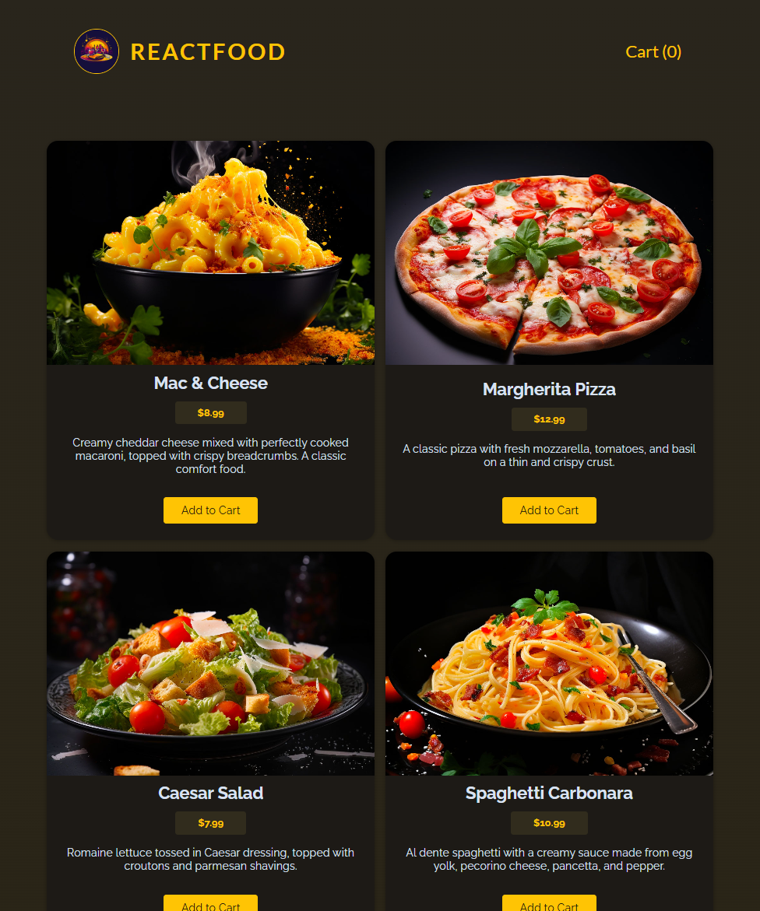

# React Food Order App with Checkout and Cart Management

A React app that allows users to order food, manage their cart, and proceed with checkout. Users can view available meals, add them to the cart, and submit an order. The app integrates with a backend API built using Express, where orders are stored and managed. React is used for handling the frontend logic, including state management, form validation, asynchronous actions, and rendering dynamic content.
This project demonstrates the use of React hooks, custom hooks, and context for managing the cart, user progress, and asynchronous HTTP requests, as well as handling form submissions, error states, and UI updates.
<br><br>


## 🚀 Getting Started

### **Prerequisites**
Make sure you have the following installed before running the project:
- **Node.js** (Download from [nodejs.org](https://nodejs.org/))
- **npm** or **yarn** (Comes with Node.js)
<br>

### **Installation**
1. Clone this repository:
   ```sh
   git clone https://github.com/nathenpriyonggo/react-food-order
   ```
2. Navigate to the directory
   ```sh
   cd react-food-order
   ```
3. Install dependencies:
   ```sh
   npm install
   ```
4. Start the development server:
   ```sh
   npm run dev
   ```
5. Open ```http://localhost:5173/``` in your browser.
<br>

## 🛠️ Built With
- **React** - A JavaScript library for building user interfaces
- **Vite** - A fast build tool for modern web projects
- **Express** - A backend framework for handling HTTP requests and managing orders
- **React Context** – For managing global state (cart and user progress)
- **Custom Hook** - useHttp for managing asynchronous HTTP requests and form submissions
- **Form Validation** – For ensuring valid input from the user before submitting the form
- **Error Handling** – For displaying error messages when something goes wrong during data fetching or form submission
<br>

## 🎮 App Features
- **View Available Meals** - Fetches meals from a backend and displays them in a list.
- **Add Meals to Cart** - Users can add meals to their cart and view the total price.
- **Checkout Process** - Users can enter their shipping information and place an order. The total price of the cart is calculated.
- **Submit Orders** - After checkout, users can submit their orders to the backend. The app uses useHttp for asynchronous data fetching and form submissions.
- **Cart Management** - Users can manage the cart, remove items, and update quantities.
- **Error Handling** - The app displays user-friendly error messages when the order submission fails or when fetching meals fails.
- **Responsive UI** - The app is responsive and works on both desktop and mobile devices.
- **Backend API** - Express backend handles order submission, meal fetching, and cart updates.
<br>

## 🧩 How It Works
1. **Frontend:**
- React App: Handles meal viewing, cart management, form validation, and order submission.
- useHttp Hook: A custom hook that handles the HTTP requests to fetch meals and submit orders asynchronously.
- State Management: Uses React Context (CartContext, UserProgressContext) to manage the cart and user progress (like checking out).
2. Backend:
- Express Server: Handles API routes for fetching meals, adding orders, and updating order status.
- File System for Data: Meals and orders are stored in JSON files (available-meals.json and orders.json).
<br>

## 📝 App Features
- **GET /meals:** Fetches a list of available meals.
- **POST /orders:** Accepts an order submission with customer and order details and saves the order.
- **POST /orders/{id}/upvote:** Upvotes a specific order by ID.
- **POST /orders/{id}/downvote:** Downvotes a specific order by ID.
<br>


## 🖥️ Preview
<p align="center"></p>
<br>

## 📜 License
This project is open-source. Feel free to fork, modify, and expand upon it!
<br><br>


---

✨ Happy coding! 🚀
